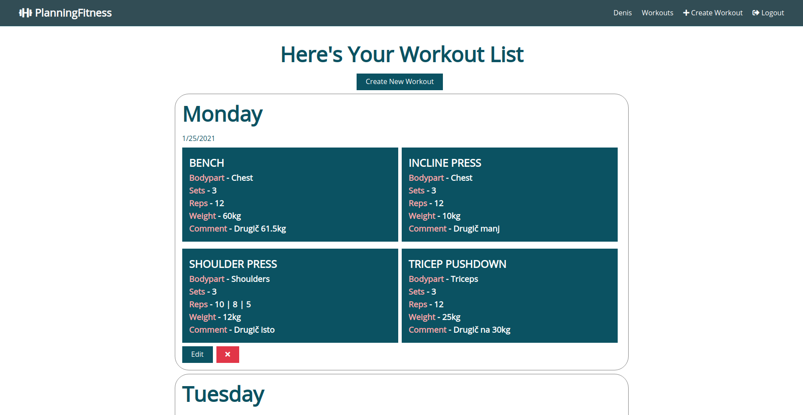
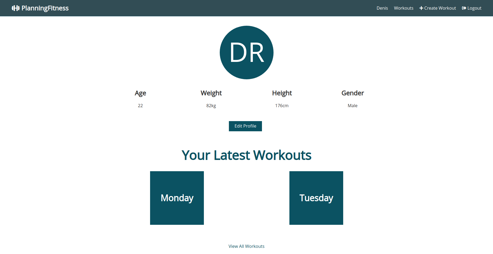

# PlanningFitness

A fitness planning app to keep track of your workouts (also installable as a PWA).

[Go To Website](https://planningfitness.herokuapp.com/)

## Tech stack
- ReactJS
- Express.js
- Node.js
- MongoDB
## Start Your Fitness Journey

With Planning Fitness, living healthy has never been easier. 

Simply create a user profile and start creating your workouts right away.

### Why use PlanningFitness?

After searching for an ideal fitness app, I came to realise there's always something missing. Either workout limitations or pricing, something was just...off.

So I took it as a personal challenge to create an app that users would actually want to use, with all the features I'd like to have myself.

### Features

- User Authentication
- User Profile Page
- Creating workouts
  - List as many exercises as you want
  - Sets, Reps, Weight used...
- Viewing workouts
- Editing workouts
- Deleting workouts

### Technical Details

- Installable as a PWA (Progressive Web App)
- Uses service workers for caching
  - app doesn't crash when offline
### Upcoming Updates

- Email verification
- Adding calories burnt to workouts
- Public Workouts Dashboard

## Screenshots

### Workouts

### Profile Page

